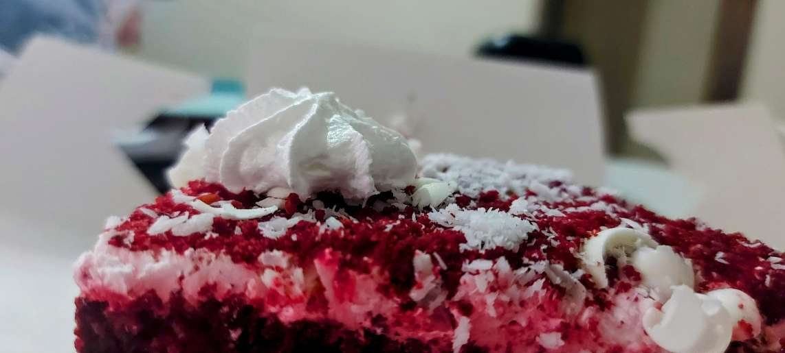

# Bethany's bakery
Using Azure AI Vision to enhance GPT-4 Turbo with Vision Responses

## Cake recipe

Image: an image of a cake, in this case, red velvet.

Prompt 1: describe the image

Prompt 2: can you provide a detailed recipe, icluding ingredients, quantities and step-by-step instructions, that could be used to recreate this cake?

## Build a bakery business

Image: a handwritten image with the business description, tagline and logo ideas

Prompt: can you refine my business description, tagline and maybe generate a logo for the business.

## Bring your data to Azure AI Studio
Data: find the complete [AI generated bakery data here.](/product.md)

Image: an image of a cake, in this case, red velvet.

Prompt 1: which cake does the image most closely resemble?

Prompt 2: how much is the cupcake?

## Video prompts

Video: a video featuring a cake, with the text "A taste of home", "affordable" and "Delicious"

Prompt 1: can you share what the video is about?

Prompt 2: how can I turn the video into an advertisment and make it more appealing to customers?
